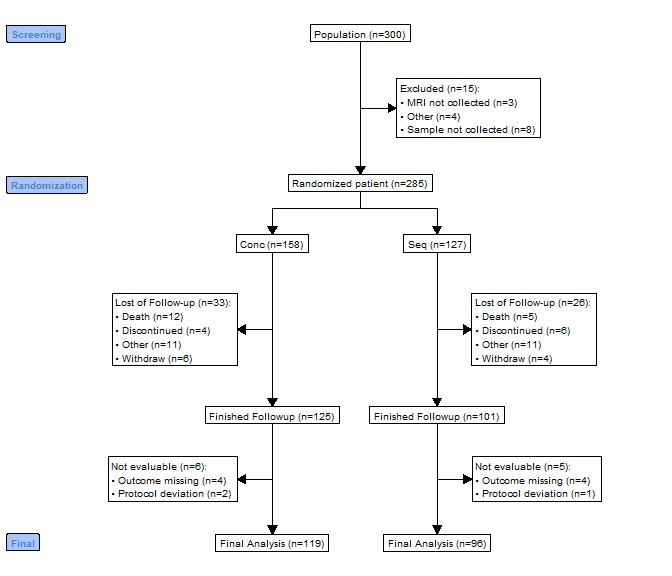
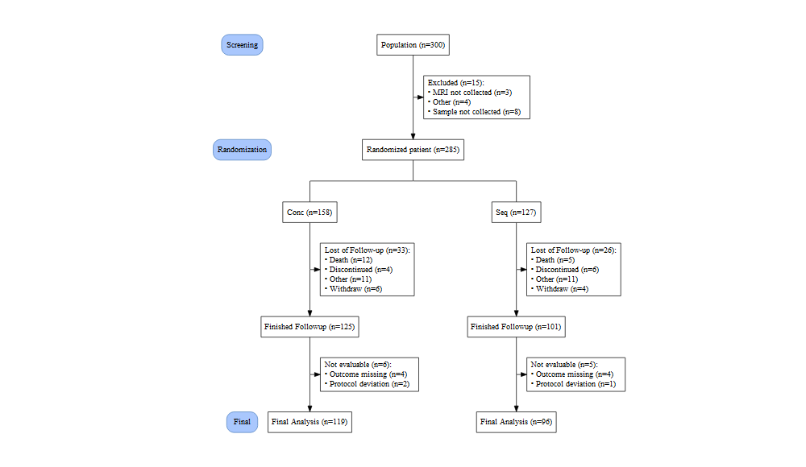

<!-- README.md is generated from README.Rmd. Please edit that file -->

# consort

<!-- badges: start -->

[](https://github.com/adayim/consort/actions)
[](https://CRAN.R-project.org/package=consort)
[](https://cran.r-project.org/package=consort)
[](https://app.codecov.io/gh/adayim/consort)
<!-- badges: end -->

The goal of `consort` is to make it easy to create CONSORT diagrams for
the transparent reporting of participant allocation in randomized,
controlled clinical trials. This is done by creating a standardized
disposition data, and using this data as the source for the creation a
standard CONSORT diagram. Human effort by supplying text labels on the
node can also be achieved.

## Installation

You can install the released version of consort from
[CRAN](https://CRAN.R-project.org) with:

``` r
install.packages("consort")
```

And the development version from [GitHub](https://github.com/) with:

``` r
# install.packages("devtools")
devtools::install_github("adayim/consort")
```

## Example

This is a basic example which shows you how to solve a create CONSORT
diagram with a given subject disposition data:

``` r
library(consort)
## basic example code
```

``` r
set.seed(1001)
N <- 300

trialno <- sample(c(1000:2000), N)
exc <- rep(NA, N)
exc[sample(1:N, 15)] <- sample(c("Sample not collected", "MRI not collected", "Other"),
                                15, replace = T, prob = c(0.4, 0.4, 0.2))

arm <- rep(NA, N)
arm[is.na(exc)] <- sample(c("Conc", "Seq"), sum(is.na(exc)), replace = T)

fow1 <- rep(NA, N)
fow1[!is.na(arm)] <- sample(c("Withdraw", "Discontinued", "Death", "Other", NA),
                            sum(!is.na(arm)), replace = T, 
                            prob = c(0.05, 0.05, 0.05, 0.05, 0.8))
fow2 <- rep(NA, N)
fow2[!is.na(arm) & is.na(fow1)] <- sample(c("Protocol deviation", "Outcome missing", NA),
                                          sum(!is.na(arm) & is.na(fow1)), replace = T, 
                                          prob = c(0.05, 0.05, 0.9))
df <- data.frame(trialno, exc, arm, fow1, fow2)
head(df)
#>   trialno  exc  arm  fow1 fow2
#> 1    1086 <NA> Conc  <NA> <NA>
#> 2    1418 <NA>  Seq  <NA> <NA>
#> 3    1502 <NA> Conc Death <NA>
#> 4    1846 <NA> Conc  <NA> <NA>
#> 5    1303 <NA> Conc Death <NA>
#> 6    1838 <NA>  Seq  <NA> <NA>
```

``` r
out <- consort_plot(data = df,
             order = c(trialno = "Population",
                          exc    = "Excluded",
                          arm     = "Randomized patient",
                          fow1    = "Lost of Follow-up",
                          trialno = "Finished Followup",
                          fow2    = "Not evaluable",
                          trialno = "Final Analysis"),
             side_box = c("exc", "fow1", "fow2"),
             allocation = "arm",
             labels = c("1" = "Screening", "2" = "Randomization",
                        "5" = "Final"),
             cex = 0.6)

plot(out)
```



As the `grid` plotting is not very ideal, calculation of the coodinates
for the nodes are not easy job and tried my best. Feel free to PR if you
want to improve. Or you can produce `Graphviz` plot by setting
`grViz = TRUE` in `plot`. This will use `DiagrammeR` to print the plot.
The plot is ideal for Shiny or HTML output.

``` r
plot(out, grViz = TRUE)
```



Or save this `Graphviz` plot to `png` or `pdf`

``` r
plot(g, grViz = TRUE) |> 
    DiagrammeRsvg::export_svg() |> 
    charToRaw() |> 
    rsvg::rsvg_pdf("svg_graph.pdf")
```
