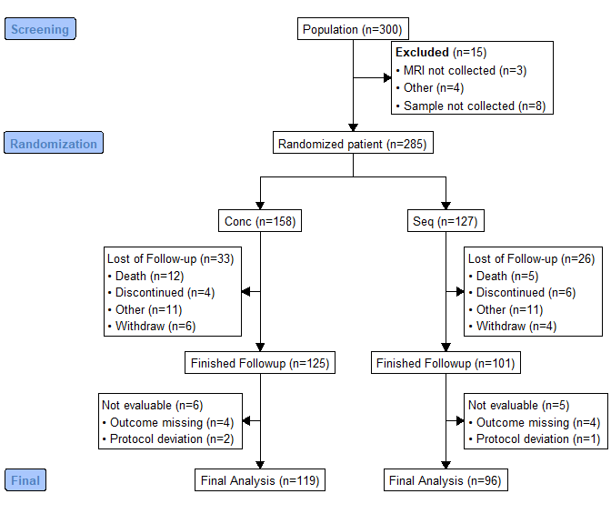
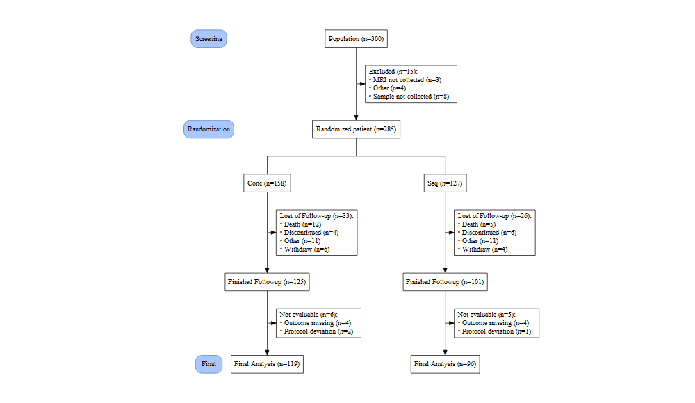

# consort2

<!-- badges: start -->

[](https://github.com/r2sas2025-svg/consort2/actions)
[](https://CRAN.R-project.org/package=consort)
[](https://cran.r-project.org/package=consort)
[](https://app.codecov.io/gh/r2sas2025-svg/consort2)
<!-- badges: end -->

`consort2` is a modern, simplified R package for creating CONSORT
(Consolidated Standards of Reporting Trials) diagrams for the
transparent reporting of participant allocation in randomized, controlled
clinical trials. Version 2.0 introduces a new declarative API, full
styling control, and improved Graphviz rendering.

## Installation

Install the development version from [GitHub](https://github.com/) with:

``` r
# install.packages("devtools")
devtools::install_github("r2sas2025-svg/consort2")
```

## Quick Start

``` r
library(consort2)

# Create a styled consort diagram object
style <- consort_style(
  line_width = 2,
  line_color = "darkblue",
  box_fill   = "lightyellow"
)

diagram <- consort(metadata = list(title = "My RCT"))
```

## Full Example

Create a CONSORT diagram from trial disposition data:

``` r
set.seed(1001)
N <- 300

trialno <- sample(c(1000:2000), N)
exc <- rep(NA, N)
exc[sample(1:N, 15)] <- sample(c("Sample not collected", "MRI not collected", "Other"),
                                15, replace = TRUE, prob = c(0.4, 0.4, 0.2))

arm <- rep(NA, N)
arm[is.na(exc)] <- sample(c("Conc", "Seq"), sum(is.na(exc)), replace = TRUE)

fow1 <- rep(NA, N)
fow1[!is.na(arm)] <- sample(c("Withdraw", "Discontinued", "Death", "Other", NA),
                            sum(!is.na(arm)), replace = TRUE,
                            prob = c(0.05, 0.05, 0.05, 0.05, 0.8))
fow2 <- rep(NA, N)
fow2[!is.na(arm) & is.na(fow1)] <- sample(c("Protocol deviation", "Outcome missing", NA),
                                          sum(!is.na(arm) & is.na(fow1)), replace = TRUE,
                                          prob = c(0.05, 0.05, 0.9))
df <- data.frame(trialno, exc, arm, fow1, fow2)
```

``` r
out <- consort_plot(data = df,
             order = c(trialno = "Population",
                          exc    = "Excluded",
                          arm     = "Randomized patient",
                          fow1    = "Lost of Follow-up",
                          trialno = "Finished Followup",
                          fow2    = "Not evaluable",
                          trialno = "Final Analysis"),
             side_box = c("exc", "fow1", "fow2"),
             allocation = "arm",
             labels = c("1" = "Screening", "2" = "Randomization",
                        "5" = "Final"),
             cex = 0.6)

plot(out)
```



Render with Graphviz (ideal for Shiny or HTML output):

``` r
plot(out, grViz = TRUE)
```



Export the Graphviz plot to PDF or PNG:

``` r
plot(out, grViz = TRUE) |>
    DiagrammeRsvg::export_svg() |>
    charToRaw() |>
    rsvg::rsvg_pdf("consort_diagram.pdf")
```

## Old vs New Approach

| Feature | consort v1.x | consort2 v2.0 |
|---|---|---|
| Styling | Limited | Full control via `consort_style()` |
| API | Imperative | Declarative |
| Rendering | grid | Graphviz (grid fallback) |
| Class system | None | S3 `consort` class |
| Validation | Minimal | Comprehensive |

## Styling

`consort2` provides a full styling system via `consort_style()`:

``` r
# Customize every visual aspect
style <- consort_style(
  line_width  = 2,
  line_color  = "darkblue",
  line_style  = "solid",
  arrow_size  = 1.5,
  arrow_type  = "closed",
  box_fill    = "lightyellow",
  box_border  = "navy",
  text_size   = 11,
  text_color  = "black",
  node_spacing = 0.6,
  arm_spacing  = 1.2
)

# Apply as a global default
options(consort.style = style)
```

## Documentation

Full documentation is available at the package website. See also:

- `vignette("consort_diagram", package = "consort2")` for a full tutorial

